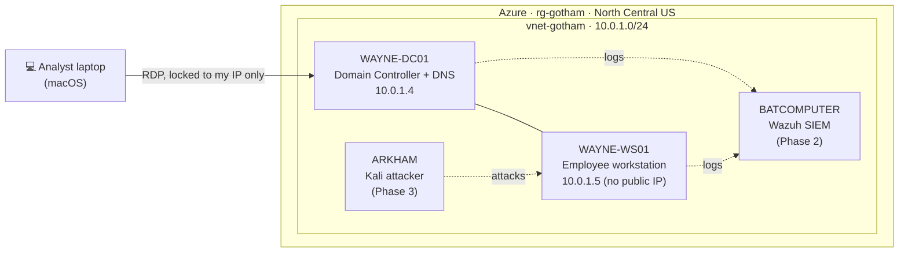
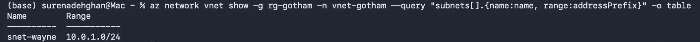
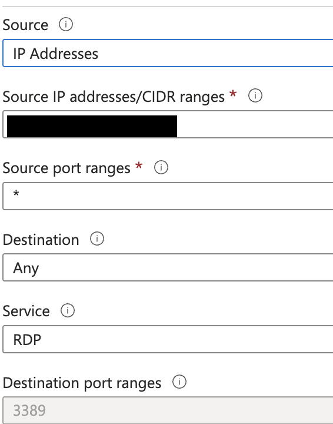
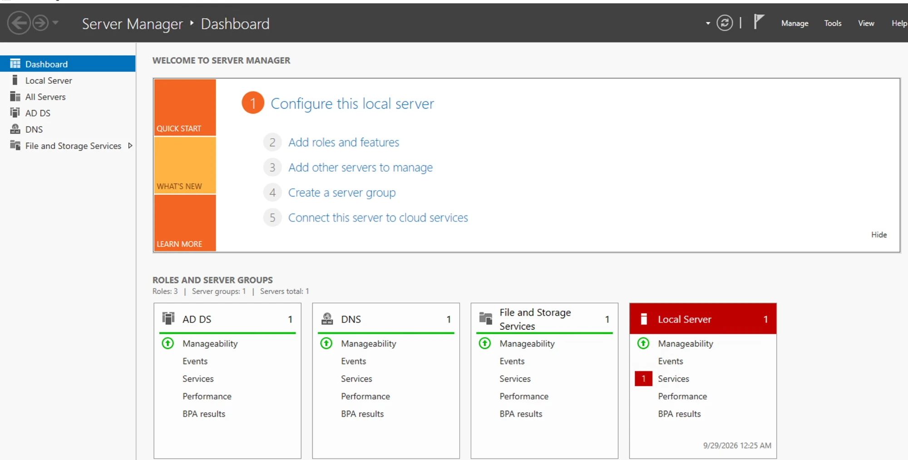
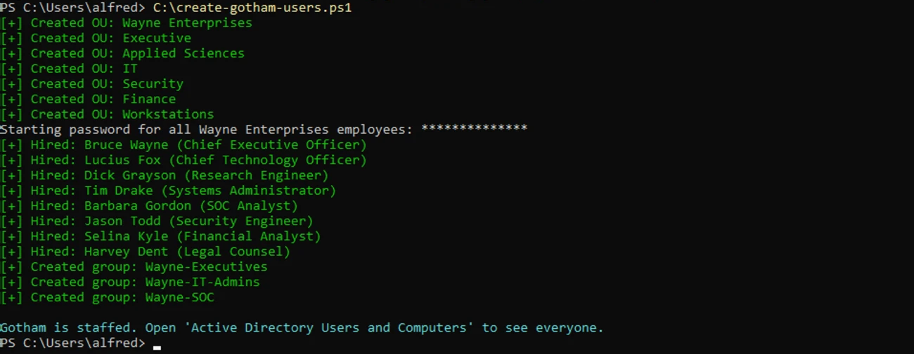
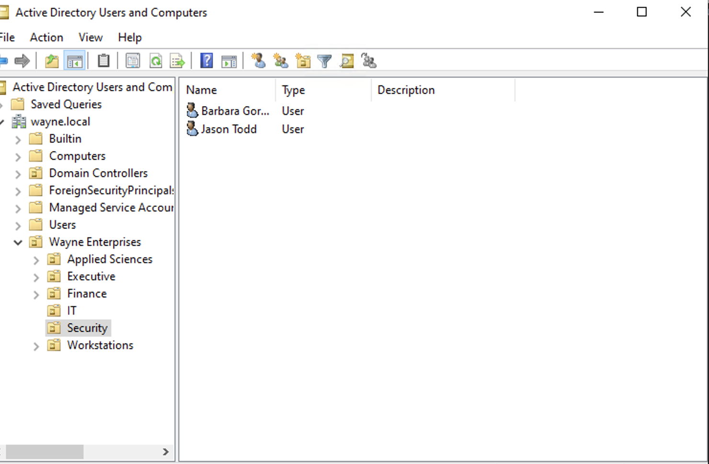
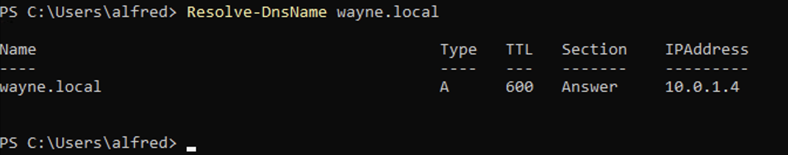
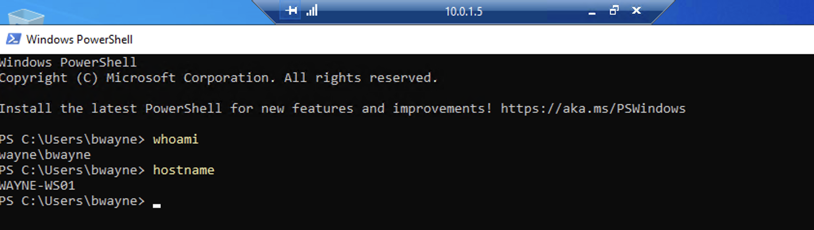

# 🦇 Wayne Enterprises SOC Lab

> *"Gotham's biggest company is under attack. Every villain has a technique. Every technique leaves evidence. My job is to find it."*

A hands-on **Security Operations Center (SOC) home lab** built in Microsoft Azure. I built a small corporate network for the fictional **Wayne Enterprises**, attacked it with real adversary techniques (each one played by a Gotham villain), then **detected, investigated, and documented** every attack the way a SOC analyst would.

The Batman theme is the story. The skills are real: Active Directory, SIEM engineering, attack simulation mapped to **MITRE ATT&CK**, detection engineering, and incident reporting.

---

## 🗺️ Lab Architecture



| Machine | Role | OS |
|---|---|---|
| `WAYNE-DC01` | Domain controller for `wayne.local`, DNS | Windows Server 2022 |
| `WAYNE-WS01` | Employee workstation (the villains' favourite target) | Windows Server 2022 |
| `BATCOMPUTER` | SIEM: collects and analyzes every log in Gotham | Ubuntu + Wazuh |
| `ARKHAM` | Attacker machine | Kali Linux |

---

## 🃏 The Rogues Gallery: Attacks Simulated

Each villain represents a real attacker technique from the [MITRE ATT&CK](https://attack.mitre.org/) framework.

| Villain | Attack style | MITRE ATT&CK techniques | Case file |
|---|---|---|---|
| 🎭 **Scarecrow** | Phishing and malicious documents: fear makes users click | T1566 Phishing, T1204 User Execution | *coming soon* |
| ❓ **The Riddler** | Reconnaissance: mapping the network, one clue at a time | T1087 Account Discovery, T1018 Remote System Discovery, T1482 Domain Trust Discovery | *coming soon* |
| 🐧 **The Penguin** | Credential theft: password spraying and dumping | T1110.003 Password Spraying, T1003 OS Credential Dumping | *coming soon* |
| 🪙 **Two-Face** | Persistence: a hidden second identity on the network | T1136 Create Account, T1053 Scheduled Task | *coming soon* |
| 🌿 **Poison Ivy** | Lateral movement: spreading from machine to machine | T1021 Remote Services | *coming soon* |
| 🤡 **The Joker** | Ransomware-style impact: chaos | T1490 Inhibit System Recovery, T1486 Data Encrypted for Impact | *coming soon* |

> All attacks are run **only against machines I own in this isolated lab**, using controlled simulation tools such as [Atomic Red Team](https://github.com/redcanaryco/atomic-red-team).

---

## 🛠️ Roadmap

- [x] **Phase 1: Build Gotham.** ✅ Azure network, domain controller, `wayne.local` domain, users, and workstation → [guide](docs/phase-1-build-gotham.md)
- [ ] **Phase 2: The Batcomputer.** Deploy Wazuh SIEM, install Sysmon and agents, get logs flowing
- [ ] **Phase 3: The villains attack.** Kali attacker and Atomic Red Team simulations
- [ ] **Phase 4: Oracle responds.** Write a detection rule for every attack
- [ ] **Phase 5: Case files.** A professional incident report per villain

---

## 📸 Phase 1: Build Gotham (Complete)

A working Windows domain, `wayne.local`, running in Azure: one domain controller, one domain-joined workstation, and a staffed org chart.

| | |
|---|---|
| **Network built from the CLI** `vnet-gotham` with subnet `snet-wayne` (10.0.1.0/24) |  |
| **Remote access locked down** RDP allowed only from the analyst's IP (redacted); all other inbound traffic denied |  |
| **Domain controller promoted** AD DS and DNS roles running on `WAYNE-DC01` |  |
| **Wayne Enterprises staffed** 7 OUs, 8 users, and 3 security groups created by [`create-gotham-users.ps1`](scripts/create-gotham-users.ps1) |  |
| **Org chart in Active Directory** The Security department: Barbara Gordon and Jason Todd |  |
| **Domain DNS working** The workstation resolves `wayne.local` to the DC |  |
| **The finish line** Bruce Wayne logs into his domain-joined workstation, reached through the DC as a jump host |  |

### 🔧 Problems I hit and how I solved them

| Problem | Root cause | Fix |
|---|---|---|
| VNet deployment failed in the portal with no error details | Student subscription restricts regions (`RequestDisallowedByAzure`) | Moved to the CLI to get a real error, then scripted a test across 9 regions: only `northcentralus` was allowed |
| Default VM size rejected (`NotAvailableForSubscription`) | Student subscriptions only allow certain SKUs per region | Queried allowed SKUs with `az vm list-skus` and chose `Standard_B2as_v2` |
| VM review showed no network security group | Portal default left the NIC without an NSG, so RDP would have been blocked | Set a Basic NSG, then restricted RDP to my IP only |
| Auto-shutdown for WS01 was rejected by region policy | The schedule resource defaulted to the resource group's region, not the VM's | Passed `--location northcentralus` explicitly |
| "Logon attempt failed" when connecting to WS01 | From a domain-joined machine, RDP assumed the `WAYNE\` domain account instead of WS01's local account | Logged in with an explicit machine prefix (`WAYNE-WS01\alfred`) |

---

## 🧠 Skills Demonstrated

- **Cloud infrastructure:** Azure VMs, virtual networks, network security groups, cost management
- **Identity:** Active Directory Domain Services, DNS, OUs, users and groups, domain joins
- **Security monitoring:** SIEM deployment, log collection, Sysmon, alert triage
- **Threat-informed defense:** attack simulation mapped to MITRE ATT&CK
- **Detection engineering:** writing and tuning custom detection rules
- **Communication:** incident reports written for both technical and non-technical readers

---

## 📁 Repository Layout

```
docs/          Step-by-step build guides for each phase
scripts/       PowerShell and shell scripts used to build and run the lab
detections/    Custom detection rules (Phase 4)
case-files/    Incident reports, one per villain (Phase 5)
screenshots/   Evidence and build screenshots
```

---

## 💰 Running It on a Student Budget

The whole lab runs on an **Azure for Students** subscription. To make the credit last:
- VMs are **deallocated** whenever I'm not using them ([`scripts/gotham-power.sh`](scripts/gotham-power.sh))
- **Auto-shutdown** is enabled on every VM as a safety net
- Budget alerts at 50%, 80%, and 90% of the credit
- Small-disk OS images and burstable B-series VM sizes

---

## ⚠️ Disclaimer

This is an educational lab. Every attack technique here was run in an isolated environment I own and control. Wayne Enterprises, Gotham, and all characters are fictional (and belong to DC Comics); no real organizations or people are involved.
